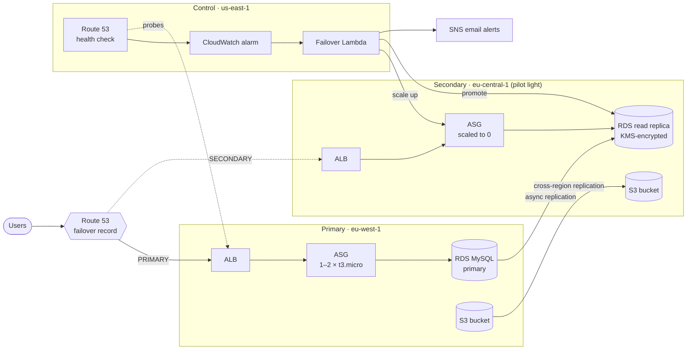

# Multi-Region Disaster Recovery on AWS (Terraform)

Automated pilot-light disaster recovery for a web application across two AWS regions. When the primary region stops answering health checks, traffic is rerouted, the standby fleet is started, and the database replica is promoted. No one has to log in and click anything.

> **Context:** Solo capstone project for my DevOps training (Feb–Apr 2025). Infrastructure is fully defined in Terraform across 13 reusable modules.

## Architecture



| Region | Role | What runs there |
|---|---|---|
| `eu-west-1` | Primary | VPC, ALB, Auto Scaling group (1–2 instances), RDS MySQL, S3 |
| `eu-central-1` | Secondary (pilot light) | VPC, ALB, Auto Scaling group at **0** instances, encrypted RDS read replica, S3 replica |
| `us-east-1` | Control plane | Health check alarm and failover Lambda. Route 53 health check metrics are only published in `us-east-1`, so the alarm has to live there. |

## How failover works

1. **Detect.** A Route 53 health check probes the primary ALB over HTTP every 30 s and marks it unhealthy after 3 consecutive failures.
2. **Reroute DNS.** The failover routing policy immediately answers with the secondary ALB instead of the primary.
3. **Trigger.** A CloudWatch alarm on `HealthCheckStatus` in `us-east-1` fires and invokes the failover Lambda.
4. **Recover.** The Lambda ([`modules/lambda/code/failover.py`](modules/lambda/code/failover.py)):
   - publishes "failover initiated" to SNS
   - scales the secondary Auto Scaling group from 0 to 1 instance (max 2)
   - waits for the read replica to be available, then **promotes it** to a standalone primary
   - waits for the promoted database and publishes "failover complete" with the new endpoint
5. **Serve.** The secondary instances boot with `USE_DR=true`, so the app points at the promoted database and the replicated S3 bucket.

Data protection while everything is healthy:
- **Database:** MySQL 8.0, encrypted at rest, 7-day automated backups, final snapshot on delete, plus an asynchronous cross-region read replica encrypted with a KMS key in the secondary region.
- **Objects:** S3 versioning with cross-region replication from the primary to the secondary bucket, and a 30-day lifecycle expiry.
- **Credentials:** the RDS master password is generated by RDS and kept in AWS Secrets Manager (`manage_master_user_password`). It never appears in code, variables, or Terraform state.

Monitoring (SNS email alerts) covers: in-service instances below 1, RDS CPU above 80%, and primary bucket size above 10 GB.

## Repository layout

```
.
├── main.tf                 # Wires the modules together across the three regions
├── provider.tf             # aws.primary / aws.secondary / aws.recover provider aliases
├── variables.tf, outputs.tf
├── terraform.tfvars.example
├── zip_lambda.sh           # Packages the failover Lambda
└── modules/
    ├── vpc/                # terraform-aws-modules/vpc, 2 AZs, public + private subnets
    ├── security_group/
    ├── elb/                # ALB, target group, HTTP listener
    ├── asg/                # Launch template + ASG; user data boots the FastAPI app
    ├── ec2/                # Standalone instance module (not used by main.tf)
    ├── rds/                # Primary MySQL instance
    ├── rds_replica/        # Cross-region read replica + KMS key
    ├── s3/                 # Versioned bucket, lifecycle, optional replication
    ├── iam_s3_replication/ # Role used by S3 cross-region replication
    ├── route53/            # Health check + PRIMARY/SECONDARY failover records
    ├── lambda/             # Failover function, IAM role, log group
    ├── trigger/            # CloudWatch alarm on the health check -> Lambda
    └── monitoring/         # SNS topic + CloudWatch alarms
```

The application the instances run is a small FastAPI service in [MawuliB/dr_app](https://github.com/MawuliB/dr_app). It exposes `/status` (shows which region's endpoints are active) and `POST /simulate_failure`, which makes the app return HTTP 500 so you can trigger a failover on purpose.

## Running it

> ⚠️ This creates billable resources in three regions: two NAT gateways, two ALBs, two RDS instances and more. Run `terraform destroy` when you're done.

**Prerequisites:** Terraform ≥ 1.5, AWS credentials with admin rights, a Route 53 hosted zone, and Ubuntu AMI IDs for both regions.

```bash
# 1. Package the failover Lambda
./zip_lambda.sh

# 2. Configure
cp terraform.tfvars.example terraform.tfvars   # fill in AMIs, bucket names, zone, alert email

# 3. Deploy
terraform init
terraform apply
```

Confirm the SNS subscription email, then test a failover:

```bash
curl -X POST "http://<primary-alb-dns>/simulate_failure?activate=true"
# Within a few minutes: alert email, the secondary ASG scales up, the replica is promoted,
# and the domain resolves to the secondary ALB.
curl http://<your-domain>/status
```

## CI

GitHub Actions runs `terraform fmt -check`, `init -backend=false` and `validate` on every push and pull request to `main`. No cloud credentials are needed.

## Known limitations and next steps

This is a training project, and these are the things I'd change before trusting it with production traffic:

- **Failback is manual.** After an incident, the original primary has to be rebuilt as a replica of the promoted database and traffic moved back by hand.
- **RPO depends on replication lag.** RDS cross-region replication and S3 replication are asynchronous, so the last seconds to minutes of writes can be lost.
- **The alarm also fires on `INSUFFICIENT_DATA`.** Missing metrics can trigger a failover. It should require a confirmed unhealthy state.
- **Least privilege.** The Lambda's ASG/RDS permissions and the CloudWatch invoke permission are broader than they need to be. They should be scoped to the specific resources and to the `lambda.alarms.cloudwatch.amazonaws.com` principal.
- **Network hardening.** SSH is open to the internet and instances sit in public subnets. They should move to private subnets behind the ALB, with SSM Session Manager instead of SSH.
- **App process.** User data starts uvicorn as root with `nohup`. A systemd unit running as a non-root user would be more robust.
- **State and environments.** There's no remote state backend (S3 + DynamoDB lock), and the RDS primary is single-AZ.
- **Provider declarations.** Child modules don't declare `required_providers`, which shows up as `terraform validate` warnings.

## Tech

Terraform · AWS (VPC, ALB, Auto Scaling, EC2, RDS MySQL, S3 CRR, KMS, Route 53, CloudWatch, Lambda, SNS, IAM, Secrets Manager) · Python (boto3, FastAPI) · GitHub Actions
